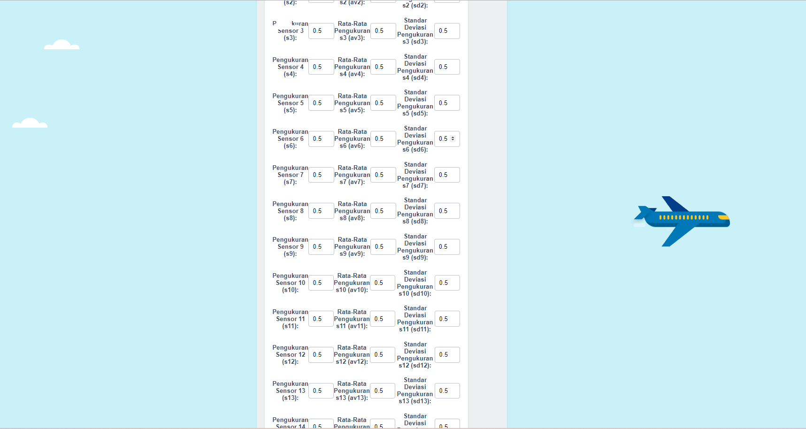

Program ini menggunakan algoritma Gradient Boosting Regressor untuk memprediksi apakah pesawat memerlukan perawatan atau tidak. 
Gradient Boost Regressor adalah salah satu algoritma estimasi yang memiliki keunggulan akurasi prediksi yang unggul terutama dalam mengolah data kompleks
Cara kerja Algoritma Gradient Boosting Regressor, yaitu dengan menggabungkan beberapa model yang lemah menjadi sebuah model yang lebih kuat.
Dalam pengaplikasiannya, Gradient Boosting biasa digunakan dalam berbagai aplikasi seperti :
1. prediksi harga saham
2. analisis risiko kredit
3. analisis sentimen
4. dan deteksi fraud.

Dalam program ini, pengguna akan diminta untuk memasukkan beberapa input melalui website yang akan digunakan sebagai faktor prediksi, yaitu :
1. jumlah siklus penerbangan (Cycle)
2. parameter setting (Setting1, Setting2, Setting3)
3. pengukuran sensor (s1 - s21) 
4. nilai rata-rata pengukuran masing - masing sensor (av1 - av21)
5. Standar Deviasi dari pengukuran sensor (sd1 - sd21)

Berdasarkan input ini, program akan menghasilkan prediksi terkait kondisi pesawat dengan keakuratan 86.53% apakah dalam kondisi baik atau memerlukan perawatan.
Running Modeling
 
 
 
 
 
 

Running Interface

 
 
 
 